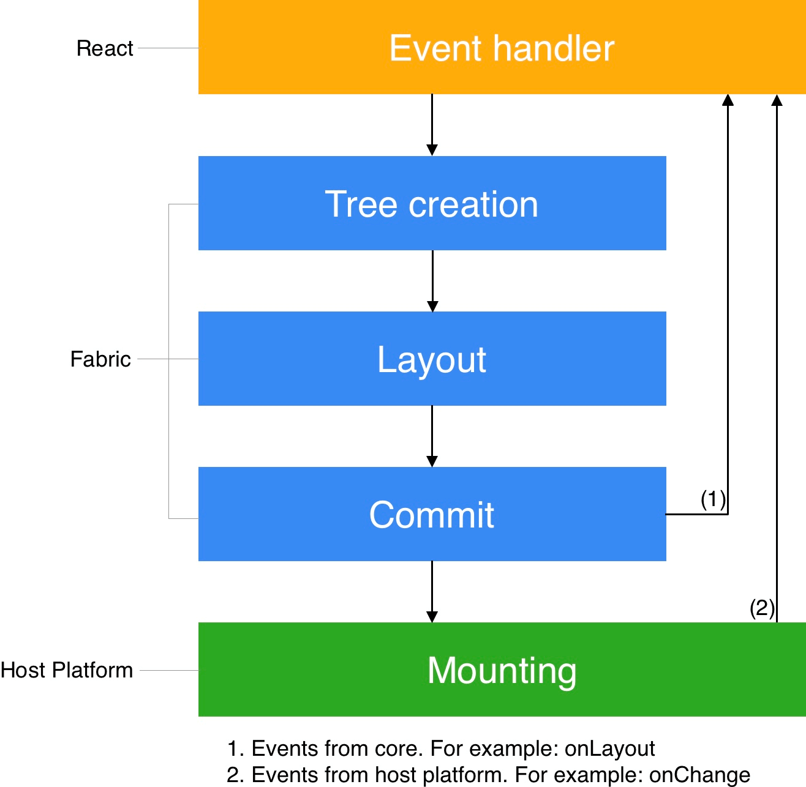
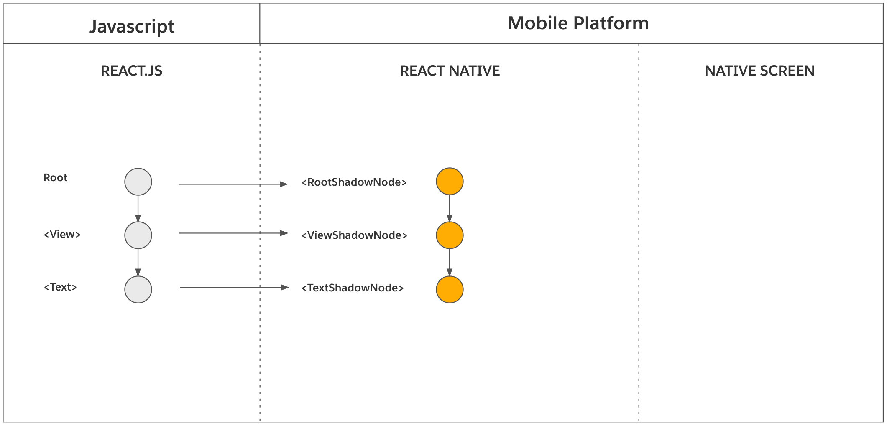
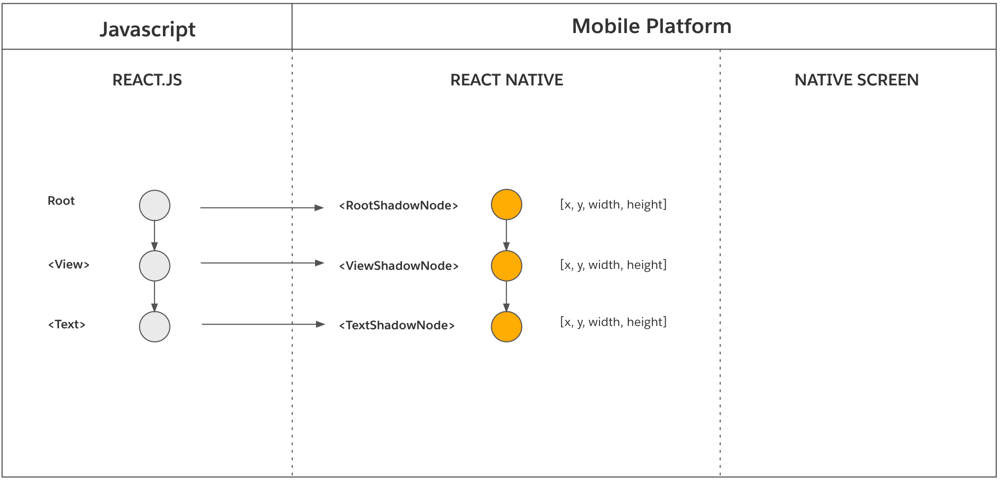
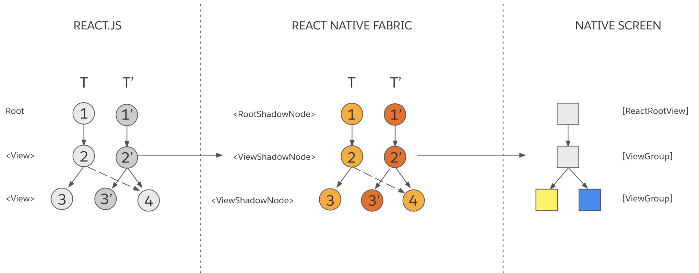
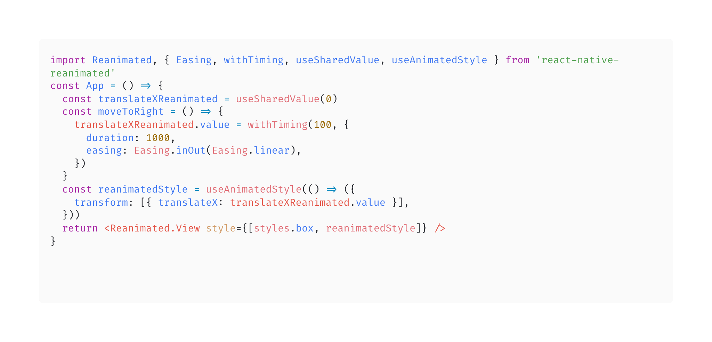
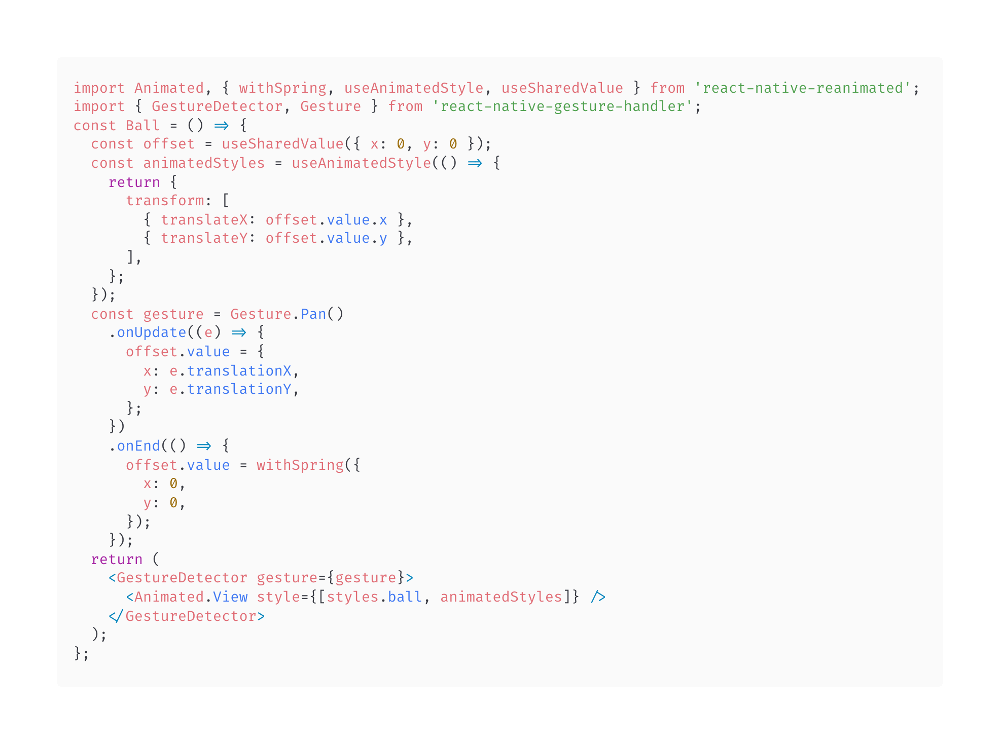

---
presentation:
  # presentation theme
  # === available themes ===
  # "beige.css"
  # "black.css"
  # "blood.css"
  # "league.css"
  # "moon.css"
  # "night.css"
  # "serif.css"
  # "simple.css"
  # "sky.css"
  # "solarized.css"
  # "white.css"
  # "none.css"
  # theme: white.css
  theme: simple.css

  # The "normal" size of the presentation, aspect ratio will be preserved
  # when the presentation is scaled to fit different resolutions. Can be
  # specified using percentage units.
  width: 1920
  height: 1080

  # Factor of the display size that should remain empty around the content
  margin: 0.1

  # Bounds for smallest/largest possible scale to apply to content
  minScale: 0.2
  maxScale: 1.5
---

<!-- slide -->

# Animation in React Native

<!-- slide -->

## What's the problem of this demo?

<iframe src="https://codesandbox.io/embed/amazing-almeida-hwrmr5?autoresize=1&fontsize=24&hidenavigation=0&theme=light"
     style="width:100%; height:900px; border:0; border-radius: 4px; overflow:hidden;"
     title="amazing-almeida-hwrmr5"
     allow="accelerometer; ambient-light-sensor; camera; encrypted-media; geolocation; gyroscope; hid; microphone; midi; payment; usb; vr; xr-spatial-tracking"
     sandbox="allow-forms allow-modals allow-popups allow-presentation allow-same-origin allow-scripts"
   ></iframe>

<!-- slide -->

## React Native Render, Commit and Mount

<div style="display: flex">
  <div style="flex: 1">
    
  </div>
  <div style="flex: 1">
    <ol>
    <li>
    <strong>Render</strong>: React executes product logic which creates a React Element Trees in JavaScript. From this tree, the renderer creates a React Shadow Tree in C++.
    <br/>
    <br/>
    </li>
    <li>
    <strong>Commit</strong>: After a React Shadow Tree is fully created, the renderer triggers a commit. This promotes both the React Element Tree and the newly created React Shadow Tree as the “next tree” to be mounted. This also schedules calculation of its layout information.
    <br/>
    <br/>
    </li>
    <li>
    <strong>Mount</strong>: The React Shadow Tree, now with the results of layout calculation, is transformed into a Host View Tree.
    </li>
    </ol>
  </div>
</div>

<!-- slide -->

## Threading Model

- **UI thread** (often called main): The only thread that can manipulate host views.
- **JavaScript thread**: This is where React’s render phase, as well as layout, are executed.

<br/>
<br/>
<br/>

Features:

- thread safe and synchronous
- immutable data structures
  - enforced by C++ “const correctness” feature
- every update in React creates or clones new objects

<!-- slide vertical=true -->

Render in a JS Thread (most common scenario)


Render in the UI Thread (high priority event on the UI Thread)


https://reactnative.dev/architecture/threading-model

<!-- slide -->

## Initial Render


```js
function MyComponent() {
  return (
    <View>
      <Text>Hello, World</Text>
    </View>
  )
}
```



<!-- - The operations (creation of React Shadow Node, creation of parent-child relationship between two React Shadow Nodes) are synchronous and thread-safe operations that are executed from React (JavaScript) into the renderer (C++), usually on the JavaScript thread.
- The React Element Tree (and its constituent React Element Nodes) do not exist indefinitely. It is a temporal representation materialized by “fibers” in React. Each “fiber” that represents a host component stores a C++ pointer to the React Shadow Node, made possible by JSI.
- The React Shadow Tree is immutable. In order to update any React Shadow Node, the renderer creates a new React Shadow Tree. However, the renderer provides cloning operations to make state updates more performant (see React State Updates for more details). -->

<!-- slide vertical=true -->




- Layout Calculation
  - [yoga](https://github.com/facebook/yoga)
  - the layout calculation of some components depend on the host platform (e.g. Text, TextInput, etc.).
- Tree Promotion
  - New Tree → Next Tree
  - The “next tree” mounts on the next “tick” of the UI Thread

<!-- slide vertical=true -->


React Shadow Tree -> Host View Tree

- Tree Diffing and [View Flattening](https://reactnative.dev/architecture/view-flattening)
  - Computes the diff between the “previously rendered tree” and the “next tree” entirely in C++.
- Tree Promotion (Next Tree → Previously Rendered Tree)
- View Mounting. This step executes in the host platform on UI thread.

<!-- slide -->

## React State Updates

```js
function MyComponent() {
  return (
    <View>
      <View style={{ backgroundColor: 'red', height: 20, width: 20 }} />
      <View style={{ backgroundColor: 'blue', height: 20, width: 20 }} />
    </View>
  )
}
```


<!-- slide vertical=true -->

Assume that as the result of a state update in JavaScript product logic, the background of the first nested <View> changes from 'red' to 'yellow'. This is what the new React Element Tree might look:

```js
<View>
  <View style={{ backgroundColor: 'yellow', height: 20, width: 20 }} />
  <View style={{ backgroundColor: 'blue', height: 20, width: 20 }} />
</View>
```

Let’s explore each phase of the render pipeline during a state update.

<!-- slide vertical=true-->


Let's assign T to the “previously rendered tree” and T' to the “new tree”:

<!-- slide vertical=true-->

- CloneNode(Node 3, {backgroundColor: 'yellow'}) → Node 3'
- CloneNode(Node 2) → Node 2'
- AppendChild(Node 2', Node 3')
- AppendChild(Node 2', Node 4)
- CloneNode(Node 1) → Node 1'
- AppendChild(Node 1', Node 2')

<br>
<br>


- Layout Calculation
  - Similar to Layout Calculation during Initial Render
- Tree Promotion (New Tree → Next Tree)
  - Similar to Tree Promotion during Initial Render.

<!-- slide vertical=true-->


- Tree Promotion (Next Tree → Rendered Tree)
- Tree Diffing
  - diff between the “previously rendered tree” (T) and the “next tree” (T')
  - UpdateView(**Node 3'**, {backgroundColor: '“yellow“})
- View Mounting



<!-- slide -->

## Now we can answer the question:

## What's the problem of first demo?

<br/>
<br/>

- This animation will be handled by the Javascript thread.<!-- .element: class="fragment" data-fragment-index="1" -->
  - Animation will get stuck because it executes rendering procedure(render, commit, mount) in every frame <!-- .element: class="fragment" data-fragment-index="1" -->
- State updates are asynchronous. <!-- .element: class="fragment" data-fragment-index="2" -->
  - This means in our case that these updates might not come at the time we think they will. <!-- .element: class="fragment" data-fragment-index="2" -->

<!-- slide -->

## React Native Animation (Official)

<iframe src="https://codesandbox.io/embed/holy-architecture-rdwgl9?fontsize=24&hidenavigation=1&theme=light"
     style="width:100%; height:900px; border:0; border-radius: 4px; overflow:hidden;"
     title="holy-architecture-rdwgl9"
     allow="accelerometer; ambient-light-sensor; camera; encrypted-media; geolocation; gyroscope; hid; microphone; midi; payment; usb; vr; xr-spatial-tracking"
     sandbox="allow-forms allow-modals allow-popups allow-presentation allow-same-origin allow-scripts"
   ></iframe>

<!-- slide vertical=true -->

### Using the native driver

```js
const translateX = useRef(new Animated.Value(0)).current

//...

Animated.timing(translateXRefValue, {
  toValue: 200,
  duration,
  easing: Easing.inOut(Easing.linear),
  useNativeDriver: true,
}).start()
```

<br/>

- Run in UI thread
  - without having to go through the bridge on every frame
  - new Animated.Value(0)
  - useNativeDriver: true
    - useNativeDriver property will default to false for legacy reasons
- Once the animation has started, the JS thread can be blocked without affecting the animation.

<!-- slide vertical-->

Weex bindingx

- https://alibaba.github.io/bindingx/guide/cn_introduce
- demo https://alibaba.github.io/bindingx/guide/cn_guide_gesture
- https://github.com/alibaba/bindingx
- https://github.com/alibaba/weex/issues/1730

<!-- slide -->

## Problems of Official React Native Animation

<br/>

- lock in 60Hz
  https://github.com/facebook/react-native/issues/29333
- not friendly for animation with gesture
- apis are complex

<!-- slide -->

## About Frame Per Second(pfs)

<br />
<br />
<br />

#### Watch Videos

60fps Record Video

vs

120fps Record Video

<!-- slide vertical=true -->

## Why movie 24fps is ok, but 24fps in game is not ok?

https://www.zhihu.com/question/21081976

- When you pause a movie, you can see the image is blur <!-- .element: class="fragment" data-fragment-index="1" -->

-  <!-- .element: class="fragment" data-fragment-index="1" -->

<!-- slide vertical=true -->

<iframe height="500" style="width: 100%;" scrolling="no" title="Motion blur Step 1" src="https://codepen.io/Nealevf/embed/dyMxvKY?default-tab=" frameborder="no" loading="lazy" allowtransparency="true" allowfullscreen="true">
  See the Pen <a href="https://codepen.io/Nealevf/pen/dyMxvKY">
  Motion blur Step 1</a> by Neale Van Fleet (<a href="https://codepen.io/Nealevf">@Nealevf</a>)
  on <a href="https://codepen.io">CodePen</a>.
</iframe>
<iframe height="500" style="width: 100%;" scrolling="no" title="Motion Blur Step 2" src="https://codepen.io/Nealevf/embed/oNxKZOx?default-tab=result" frameborder="no" loading="lazy" allowtransparency="true" allowfullscreen="true">
  See the Pen <a href="https://codepen.io/Nealevf/pen/oNxKZOx">
  Motion Blur Step 2</a> by Neale Van Fleet (<a href="https://codepen.io/Nealevf">@Nealevf</a>)
  on <a href="https://codepen.io">CodePen</a>.
</iframe>
realistic motion blur
https://css-tricks.com/how-to-create-a-realistic-motion-blur-with-css-transitions/

<!-- slide -->

## React Native Reanimated

https://docs.swmansion.com/react-native-reanimated/

easily create smooth animations and interactions that run on the UI thread.

<!-- slide -->



- Define animatable elements.
- Shared values are a driving factor of all animations
  - useSharedValue hook
- Modify shared values using animation functions like withTiming

<!-- slide -->

## React Native Reanimated Api


https://docs.swmansion.com/react-native-reanimated/docs/fundamentals/getting-started/

<!-- slide -->

#### Watch Videos Gesture Demo



<!-- slide -->

## Bonus

### Spring Animation

https://gaohaoyang.github.io/2021/03/01/spring-animation-framer-motion/

<!-- slide -->

# Summary

- React Native Render, Commit and Mount
- Threading Model
- React Native Animation (Official)
- About Frame Per Second(pfs)
- React Native Reanimated
- Spring Animation

<!-- slide -->

# Thanks

---

Haoyang Gao

2023.11.17
